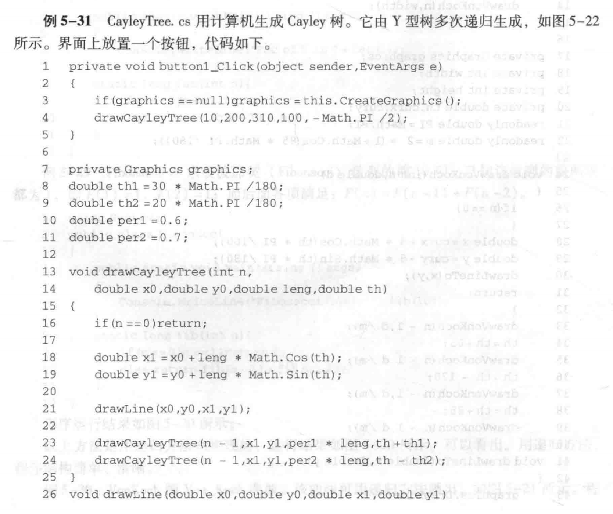
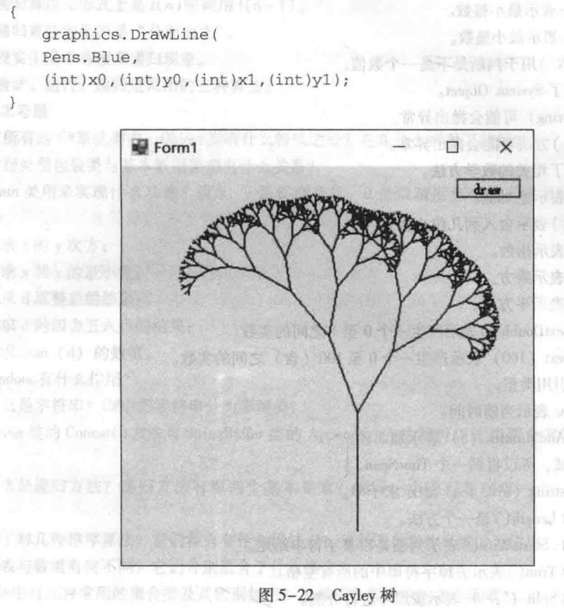

# 第四次作业
## 作业 1
将课本中例 5-31 的 Cayley 树绘图代码进行修改。添加一组控件用以调节树的绘制参数。参数包括递归深度（n）、主干长度（leng）、右分支长度比（per1）、左分支长度比（per2）、右分支角度（th1）、左分支角度（th2）、画笔颜色（pen）。

## 作业 2
为订单管理的程序添加一个 WinForm 的界面。通过这个界面，调用 OrderService 的各个方法，实现创建订单、删除订单、修改订单、查询订单、导出订单、导入订单等功能。

要求：
1. WinForm 的界面部分单独写一个项目，依赖于原来的项目。
2. 可以使用两个窗口。主窗口实现查询展示功能，以及放置各种功能按钮。新建/修改订单功能使用弹出窗口。
3. 注意窗口的布局，在窗口尺寸变化时，不出现错位挤压等情况。
4. 尽量通过数据绑定来实现功能。订单和订单明细各使用一个 bindingsource，通过 DataMember 来实现主从对象绑定。